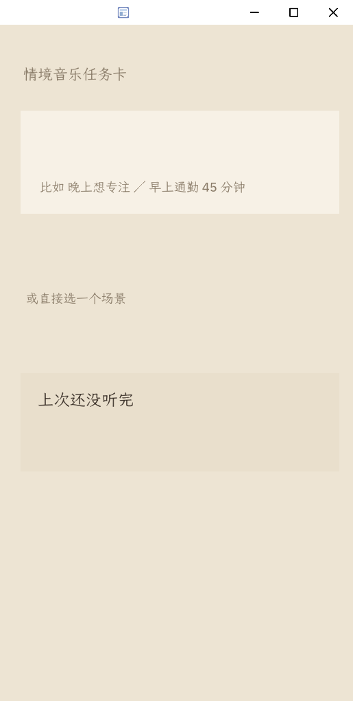
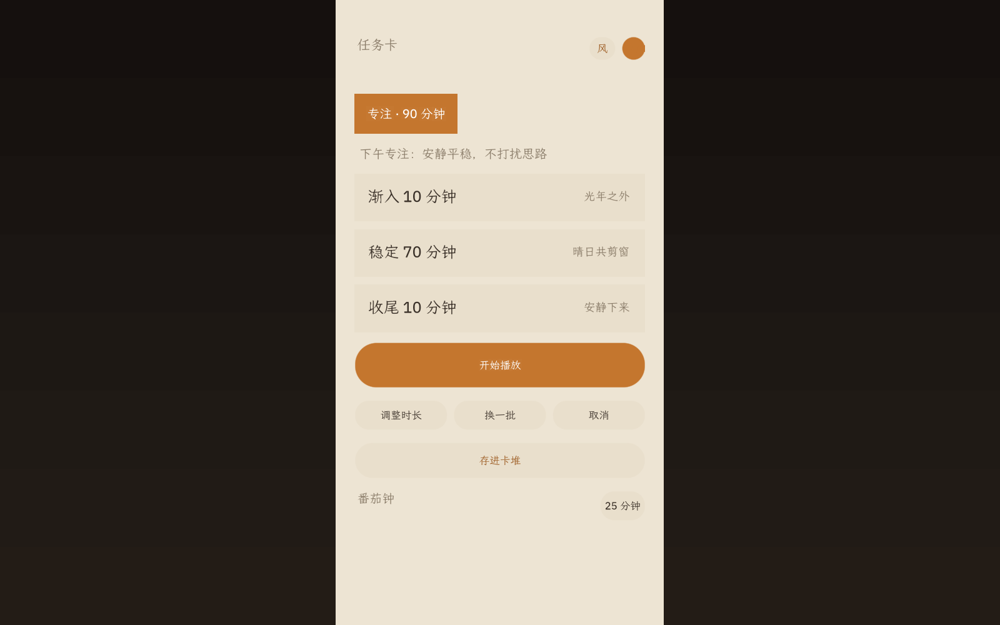
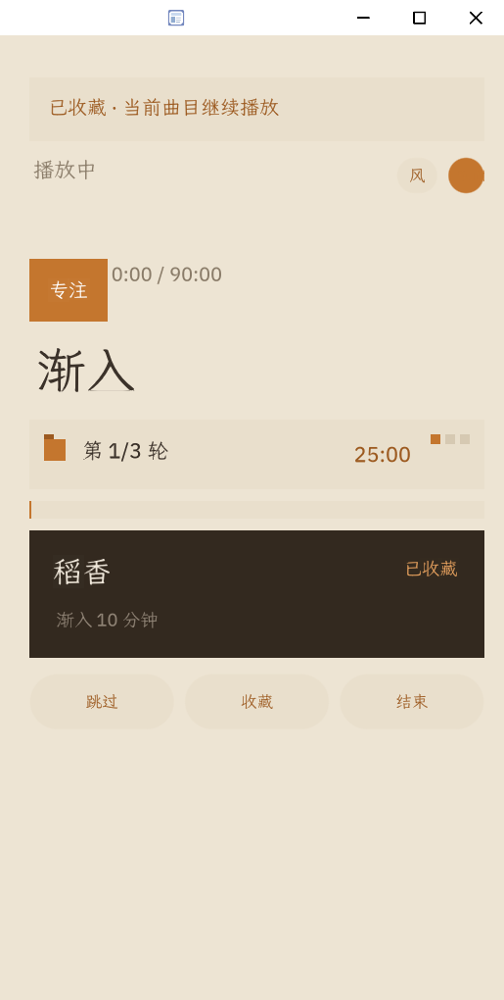
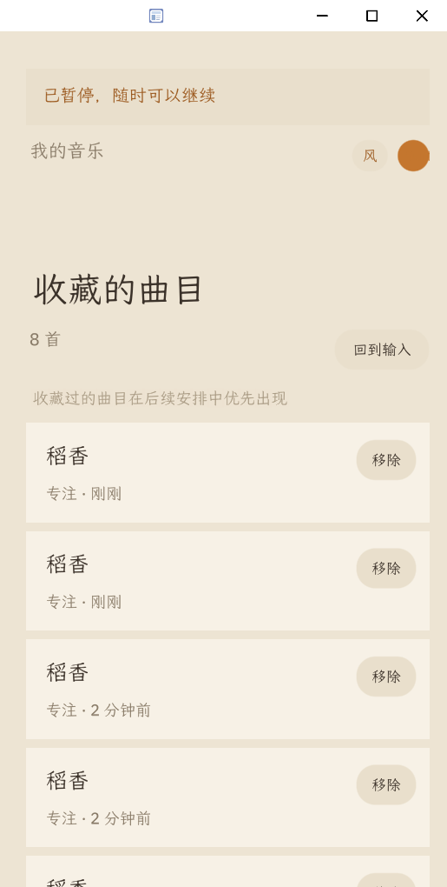

# 情境音乐任务卡（music.cue）

说一句现在想做什么，得到一张分好段、写好理由的播放任务卡。

运行在 [OctoSense](https://github.com/OctoSense-org/OctoSense) 上的 OctoScript / Splash 应用，
为 GoSIM Agentic App 2026 初赛提交而作。

## 这是什么

用户打开音乐 App 时，真正在想的通常不是「听哪首歌」，而是「接下来这一段时间我打算怎么过」。
现有产品把选什么、听多久这件事原样丢回给用户，于是大多数时候我们只是随手点开一个歌单。

music.cue 把这个顺序倒过来：先说一句现在的状态，比如「晚上想专注」「早上通勤 45 分钟」，
由它排出一张播放任务卡——场景、总时长、渐入／稳定／收尾三段，以及每一段为什么这么排。
确认之后卡片开始计时，播放途中可以收藏、跳过、改时长，也可以存档下次接着用。

产品上刻意守住了三条边界：

- **不播放音乐。** 进度按三段时长本地模拟推进，界面上有明确标注。
- **不接入版权曲库。** 曲库是内置的示例数据，用于演示卡片结构，不存储、不传输任何音频内容。
- **不是四个 AI 进程。** 宿主当前没有 shell 真正运行多 Agent，`model.complete` 在 card-host
  返回 no service。感知、决策、编排、守护是四个纯代码模块，由状态机按序调度，
  决策走本地规则表；AI 分支已预留，默认关闭。

## 主要功能

- **情境识别**：专注、通勤、睡前、健身、休息五类场景，中英文关键词命中。时长从原话里取
  （第一个 ≥ 5 的数字）。原话中的时间语义优先于系统时间——说「早上通勤」，夜里测也是早上桶。
- **三段任务卡**：渐入／稳定／收尾，每段给出理由与来源曲目。时长闭合校验不通过会重排一次，
  仍不通过则降级为单段简化卡。
- **只问一次**：场景没识别出来时问一次「现在在做什么」，也可以点「你帮我决定」直接兜底为专注。
  时间取系统值、环境默认室内，都不主动追问。
- **番茄钟**：专注场景默认 25 分钟一轮，稳定段按轮切分，每 4 轮结束提示长休，可切 25 / 45 / 60。
- **播放中微调**：改时长、切番茄档位、「换一批」重抽三段曲目（段落结构与时长保留）。
- **偏好回流**：收藏 +1.0／次，跳过 −1.5／次；同一首跳过 2 次进黑名单；收藏过的曲目后续优先出现。
- **续播**：中途退出会保存进度快照，下次打开提示续播，播完自动清除。
- **卡堆**：最多存 8 张卡片，超出归档最旧的一张，可从卡堆里直接重启任意一张。
- **我的音乐**：查看收藏过的曲目与收藏时间，可逐条移除。
- **本周概览**：近 7 天时长柱状图、专注小时数、通勤次数、收藏数。
- **三套视觉**：暗色沉浸／浅色温柔／编辑部排版，选择写入偏好；暗色下不同场景的氛围色相不同。
- **全部本地**：收藏、跳过、播放历史、续播快照、事件日志写入应用私有空间，配额 16 MiB；
  只申请 `storage` 能力，不联网、不登录（登录归宿主）。

## 演示视频

尚未录制。录制后命名为 `demo.mp4` 放在仓库根目录，本节用相对路径引用。

## 应用截图

以下均为 Windows card-host 的真实渲染截图。

| 输入页 | 任务卡 |
| --- | --- |
|  |  |

| 播放中 | 我的音乐 |
| --- | --- |
|  |  |

## 快速开始

需要 Python 3 和构建好的 OctoSense App Hub 宿主工具。三步跑起来，完整说明见[本地运行](#本地运行)：

```sh
cd <workspace>/OctoScript-App-Design-Flow
python tools/octo doctor                              # 环境自检，应 6/6 全绿
python tools/octo run <app>/bundle --port 8141 --hidden --detach
python tools/octo check <app>/bundle                  # 门检，应为 PASSED
```

## 本地运行

**构建宿主工具（只需一次）：**

```sh
cd <workspace>/OctoSense-App-Hub
cargo build --release -p octosense-card-host -p octosense-app-hub
```

**让 `tools/octo` 找到它们。** Windows 上它的 `find_binary()` 只找裸名、不试 `.exe`，两种方式任选：

```sh
# 方式一：显式环境变量
export OCTO_HUB="<App-Hub>/target/release/hub.exe"
export OCTO_CARD_HOST="<App-Hub>/target/release/card-host.exe"
export OCTOSENSE_APP_HUB="<App-Hub>"
```

```sh
# 方式二：把 release 目录加进 PATH（shutil.which 会自动试 PATHEXT）
export PATH="$PATH:<App-Hub>/target/release"
```

**启动、截图、停止：**

```sh
python tools/octo run <app>/bundle --port 8141 --hidden --detach   # 启动（无头，后台）
python tools/octo shot 8141 <app>/bundle/screenshots/01-main.png   # 截图
curl -s 127.0.0.1:8141/quit                                        # 停止
```

自动化测试走宿主的远程桥接：

| 端点 | 用途 |
| --- | --- |
| `GET /snap` | 组件树 JSON（根节点 `ty="Splash"` 需过滤） |
| `GET /click?x=&y=&wait=` | 点击 |
| `GET /t?t=<urlencoded>` | 输入文本 |
| `GET /quit` | 停止 |

**Windows 开发提效：**

- `dev.bat` — 一键环境：`dev.bat doctor` / `run` / `shot` / `check` / `quit`，
  或直接 `dev.bat` 进入已配好环境变量的 shell
- `open.sh` — 以 `1280x800` 打开可见窗口（设计主档宽度；`octo run` 默认 412 宽会裁掉内容列），
  使用独立数据目录 `.demo-state`，避免测试写入污染演示状态

运行产物在 `.local-state/`（应用私有空间、偏好、续播快照与事件日志），已被 Git 忽略。

## 怎么用

输入一句话即可：

```
晚上想专注
早上通勤 45 分钟
睡前听点安静的
健身
```

流程：

1. 说一句话，或直接点选场景（专注／通勤／睡前／健身）
2. 场景没识别出来时会问一次「现在在做什么」——只问一次，不连环追问
3. 确认卡片：场景、时长、三段结构与每段理由都摊开显示，点「开始播放」
4. 播放中可以收藏或跳过，每次都会立刻换一首同风格的
5. 需要调整就改时长、切番茄档位或「换一批」
6. 随时「结束」，下次打开提示续播；输入页可进「我的音乐」「卡堆」「统计」

## 目录结构

```
music-cue/
├── bundle/                  # 提交给 App Hub 的应用包
│   ├── main.splash          # 全部应用逻辑（状态机 + 四个模块 + 界面）
│   ├── manifest.json        # id / 版本 / 能力声明
│   ├── listing.json         # 上架信息（名称、简介、截图、许可）
│   ├── assets/icon.svg
│   └── screenshots/         # README 与上架用的真实渲染截图
├── dev.bat                  # Windows 一键：doctor / run / shot / check / quit
├── open.sh                  # 打开可见窗口（1280x800，独立演示数据目录）
├── AGENTS.md  CLAUDE.md  GEMINI.md
└── .local-state/            # 本地运行产物，已被 Git 忽略
```

测试脚本（`test_all.py`、`test_stage*.py` 等）位于上层 `apps/` 目录，未纳入本仓库。
运行一次约 115 条断言、70 秒，全部基于真实运行：读 `/snap` 断言界面文本与 `preference.json`
实际内容，并检查运行日志中无 `[E]` 错误。

## 技术栈

- **OctoScript / Splash** — 应用实现语言，单文件 `main.splash`
- **OctoSense App Hub** — 宿主运行时（`hub` 打包校验、`card-host` 运行与远程桥接）
- **Makepad** — 底层 UI 渲染
- **Rust** — 构建宿主工具
- **Python 3** — `tools/octo` 工具链与测试脚本
- **应用私有 fs** — 唯一申请的能力 `storage`，配额 16 MiB

## 许可证

Apache-2.0（在 `bundle/listing.json` 中声明；仓库暂未附带独立的 LICENSE 文件）。
